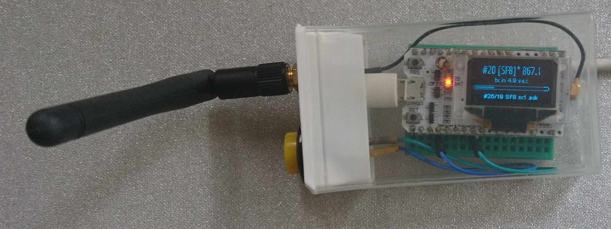

# LoRaWAN EU868 Data Rate Tester

Tests LoRaWAN uplinks by quickly cycling through different data rates, (ab)using the EU868 maximum
duty cycle, optionally using confirmed uplinks to also test downlinks (but without actually retrying
if no confirmation is received), and always using the maximum transmission power.

:warning: Regional maximum duty cycle regulations may not be the only limitation that applies. For
The Things Network, 30 seconds uplink and 10 downlinks per day apply for its Fair Access Policy.

:warning: This is REALLY just a quick & dirty sketch: the code to display the timers and to disable
the auto-retry for confirmed uplinks is mostly trial & error, hence may rely on internals of a
specific LMIC version. It is not a good base for further development.

## Usage

While awaiting a transmission, the display shows the uplink counter, SF and channel for the upcoming
uplink, and shows the same while awaiting its receive windows. For a downlink it also shows the
uplink's counter and SF, along with the downlink counter and receive window. As RX1 in EU868 uses
the same settings as the uplink, and RX2 in EU868 always uses SF9, the downlink's SF is not
explicitly displayed.

A single button is used for control:

- Press once to skip to the next data rate.

- Press twice to toggle confirmed/unconfirmed uplinks. An asterix after the data rate indicates
  that confirmed uplinks are enabled.

- Long press to toggle between automatic cycling through the predefined list of data rates, and
  manual cycling through SF7..SF12. Square brackets around the data rate indicate that it is fixed.
  (Changing this mode after a transmission, while awaiting the receive windows for a confirmed
  uplink, may yield the wrong uplink details to be displayed with the downlink.)

The above photo shows:

- `#15 [SF8]* 867.1`
  - `#15`: next uplink will use frame counter is 25
  - `SF8`: next uplink will use spreading factor is SF8
  - `[..]`: manual mode is active; subsequent uplinks will also use SF8
  - `*`: confirmed uplinks are active
  - `867.1`: next uplink will use 867.1 MHz

- `tx in 4.9 sec`: the countdown progress bar, showing how much waiting time is left, to comply
  with the maximum duty cycle regulations

- `#26/19 SF8 rx1 ack`
  - `#26/19`: the last downlink counter was 26, and was received after uplink 19 (the downlink
    counter being larger than the uplink counter implies that the device was restarted without
    resetting the counters in TTN Console, and also implies that apparently the frame counter
    security was disabled in TTN Console)
  - `SF8`: uplink 19 was sent using SF8
  - `rx1`: downlink 26 was received in RX1 (hence for EU868 was using the same SF as the uplink; if
    it was received in RX2 then for EU868 it would have used SF9) 
  - `ack`: the downlink had its FCtrl.ACK bit set

For an actual application-level downlink, the downlink data will be shown at the bottom as well.

## Setup

This has only been tested with [the first release](doc/heltec-wifi-lora-32/README.md) of the "Heltec
WiFi LoRa 32" board, for EU868, on [PlatformIO][pio] 4.3.4.

[pio]: https://platformio.org/

- Connect a button to `GND` and `IO0` (or use the program button).

- Register an ABP device. You probably want to disable frame counter security in TTN Console. Beware
  that such only applies to the uplink counters that are accepted by TTN; the downlink counters will
  still increase endlessly, until manually resetting those. When resetting while this sketch is
  running, you may see that LMIC ignores downlinks that have a counter that's not greater than its
  last known value.

- Copy [`include/config-example.h`](include/config-example.h) into a file `config.h` and configure
  the LoRaWAN ABP settings.

- When not using EU868, or when not using The Things Network:

  - In [`platformio.ini`](platformio.ini) set [the MCCI LMIC build flags][mcci_flags]. 

    [mcci_flags]: https://github.com/mcci-catena/arduino-lmic#platformio
  
  - In [`main.cpp`](src/main.cpp) review all code labeled `EU868`, and all code using
    `12 - LMIC.datarate`, like calls to `LMIC_setupChannel` and `display.setSpreadingFactor`.

- Execute `pio run` to create the hidden `.pio` folder, download dependencies, build the project,
  and upload it to the board (if connected).

## Implementation choices

- `LinkCheckReq` may be a more descriptive alternative for a confirmed uplink, but MCCI LMIC 3.2.0
  [does not seem to support LinkCheckAns][LinkCheckAns].
  
  [LinkCheckAns]: https://github.com/mcci-catena/arduino-lmic/blob/v3.2.0/src/lmic/lmic.c#L917-L921
 
- The state machine and display handling is running in its own core; of course that's quite some
  overkill for this simple use case. In fact, it may mess up logging a bit, when both cores write to
  the log simultaneously.
  
## Common issues

### error: 'DR_SF12' was not declared in this scope

You did not configure MCCI LMIC to use EU868.
