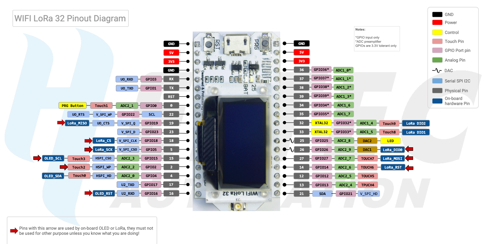

# Heltec WiFi LoRa 32 board

## Pinout (first release)

.

## LMIC pin mapping

For [LMIC use](https://github.com/mcci-catena/arduino-lmic#manual-configuration):

```cpp
// Pin mapping
const lmic_pinmap lmic_pins = {
    .nss = SS, // active-low SPI slave-select; pin 18
    .rxtx = LMIC_UNUSED_PIN, // rx/tx control
    .rst = RST_LoRa, // reset; pin 14
    .dio = {DIO0, DIO1, DIO2} // digital input/output; pins 26, 33, 32
};
```

## Board details

According to the manufacturer:

> - Dominant Frequency: 240MHZ
> - Flash: 32M-Bits
> - Processor: for Tensilica LX6 Dual Core
> - Master chip: ESP32, chip built-in 520 KB SRAM
> - Computing capacity: up to 600DMIPS
> - LoRa chip: SX1276, +20 dBm power output
> - Receiver sensitivity: -139dBm (SF12, 125KHZ)
> - 0.96-inch blue OLED display
> - Dual-mode Bluetooth: traditional Bluetooth and BLE low-power Bluetooth
> - Operating voltage: 3.3 - 7V
> - Operating temperature range: -40 - 90 °C
> - UDP continuous throughput: 135Mbps
> - USB adapter chip: CP2102
> - 802.11 b/g/N HT40 Wi-Fi transceiver
> - Support mode: Sniffer, Station, softAP and Wi-Fi Direct
> - Transmit power: 19.5dBm@11b, 16.5dBm@11g, 15.5dBm@11n
> - Data rate: 150Mbps@11n HT40, 72Mbps@11n HT20, 54Mbps@11g, 11Mbps@11b
> - Lithium battery charging circuit and interface

According to [the ESP8266 and ESP32 serial bootloader utility](https://github.com/espressif/esptool):

```text
$ esptool.py chip_id

Serial port /dev/cu.SLAB_USBtoUART
Detecting chip type... ESP32
Chip is ESP32D0WDQ6 (revision 1)
Features: WiFi, BT, Dual Core, Coding Scheme None
Crystal is 26MHz
```

See also [its PlatformIO details][pio_board].

[pio_board]: https://docs.platformio.org/en/latest/boards/espressif32/heltec_wifi_lora_32.html

## CP210x drivers

CP210x USB to UART Bridge Virtual COM Port (VCP) drivers are required to facilitate host
communication with CP210x products. The drivers can be downloaded from [Silicon Labs][silabs].

[silabs]: https://www.silabs.com/products/development-tools/software/usb-to-uart-bridge-vcp-drivers
